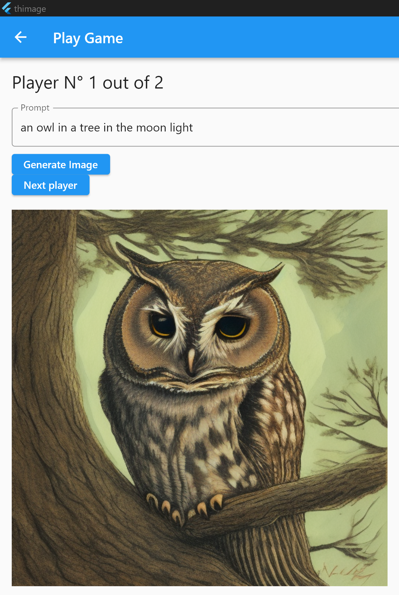
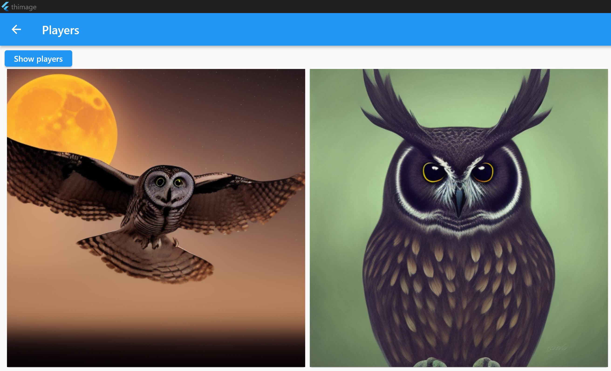
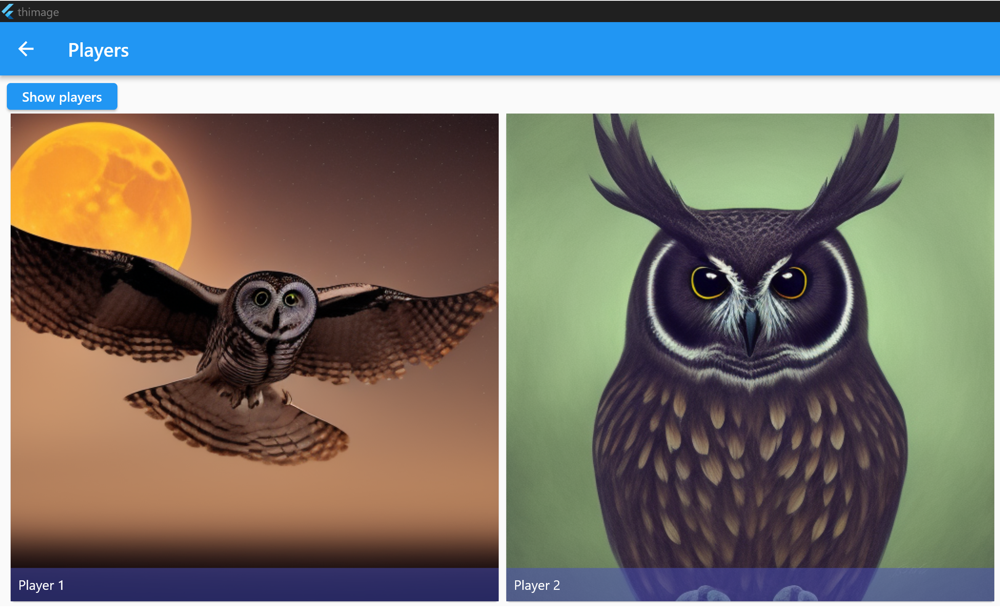

# thimage

Flutter game.

Each player creates his/her image with his/her prompt while keeping it hidden from the other players.
Once all images are created (1 image per player), the players vote for the one they prefer or try to retrieve who has created which image.

This flutter app uses stable diffusion to generate the images.

After pressing the "Show players" button.

Enjoy ;)

## Getting Started

This project is a starting point for a Flutter application.

A few resources to get you started if this is your first Flutter project:

- [Lab: Write your first Flutter app](https://docs.flutter.dev/get-started/codelab)
- [Cookbook: Useful Flutter samples](https://docs.flutter.dev/cookbook)

For help getting started with Flutter development, view the
[online documentation](https://docs.flutter.dev/), which offers tutorials,
samples, guidance on mobile development, and a full API reference.
